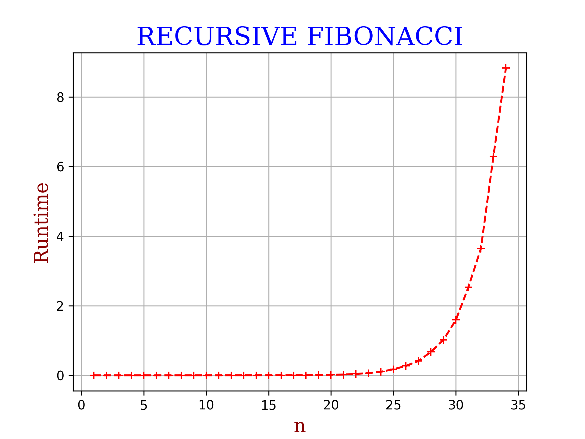

# Brief:
***
```python
"""
...
This module implements methods for finding fibonacci numbers, namely:

    1. fib_recursive() ->
        A function that, given an integer n, finds the n-th fibonacci number
        using the recursion relationship F(n) = F(n-1) + F(n-2).
        As is to be expected, this method has O(2^n) time complexity
        and is a very inefficient method of finding the solution.

    2. fib_memoized() ->
        Acknowledging that the recursive function recomputes many values,
        this method attempts to improve runtime by saving values once seen
        reusing them in later calls to the same i-th fibonacci number.
        This is expected to have O(n) time complexity, but is it optimal?

    2. fib_iterative() ->
        Using Dynamic Programming and our knowledge of the fibonacci sequence,
        this function, given an integer n, builds the n-th fibonacci sequence
        from the ground up, iterating n times and swapping values between two variables.
        This has O(n) time complexity and much better space complexity than the memoized version.

    3. fib_matrix() ->
        A better way to compute the fibonacci sequence, this function acknowledges that
        the n-1 exponential of the matrix [[1, 1], [1, 0]] contains the n-th fibonacci
        number for any n.
        Thus, we compute the n-th number by matrix exponential, which takes us
        O(log n) time.

    (c) Amittai J. Wekesa (github: @siavava), May 2021.
...
"""
```

***
## Individual results

### Recursion

#### Results
```python
The fibonacci number 1 using recursion is 1
The fibonacci number 2 using recursion is 1
The fibonacci number 3 using recursion is 2
The fibonacci number 4 using recursion is 3
The fibonacci number 5 using recursion is 5
The fibonacci number 6 using recursion is 8
The fibonacci number 7 using recursion is 13
The fibonacci number 8 using recursion is 21
The fibonacci number 9 using recursion is 34
```
#### Runtime



### Iteration

#### Results
```python
The fibonacci number 1 using iteration is 1
The fibonacci number 2 using iteration is 1
The fibonacci number 3 using iteration is 2
The fibonacci number 4 using iteration is 3
The fibonacci number 5 using iteration is 5
The fibonacci number 6 using iteration is 8
The fibonacci number 7 using iteration is 13
The fibonacci number 8 using iteration is 21
The fibonacci number 9 using iteration is 34
```
#### Runtime


### Memoization

#### Results
```python
The fibonacci number 1 using memoization is 1
The fibonacci number 2 using memoization is 1
The fibonacci number 3 using memoization is 2
The fibonacci number 4 using memoization is 3
The fibonacci number 5 using memoization is 5
The fibonacci number 6 using memoization is 8
The fibonacci number 7 using memoization is 13
The fibonacci number 8 using memoization is 21
The fibonacci number 9 using memoization is 34
```

#### Runtime


### Matrix exponentiation
#### Results
```python
The fibonacci number 1 using matrix exponentiation is 1
The fibonacci number 2 using matrix exponentiation is 1
The fibonacci number 3 using matrix exponentiation is 2
The fibonacci number 4 using matrix exponentiation is 3
The fibonacci number 5 using matrix exponentiation is 5
The fibonacci number 6 using matrix exponentiation is 8
The fibonacci number 7 using matrix exponentiation is 13
The fibonacci number 8 using matrix exponentiation is 21
The fibonacci number 9 using matrix exponentiation is 34
```

#### Runtime


***

# Comparison
```python
We do not include the recursive implementation because it takes too long to complete 
for this problem range and it shoots off the range of the others, making the data about the others 
be clustered towards zero and less informative.
```

