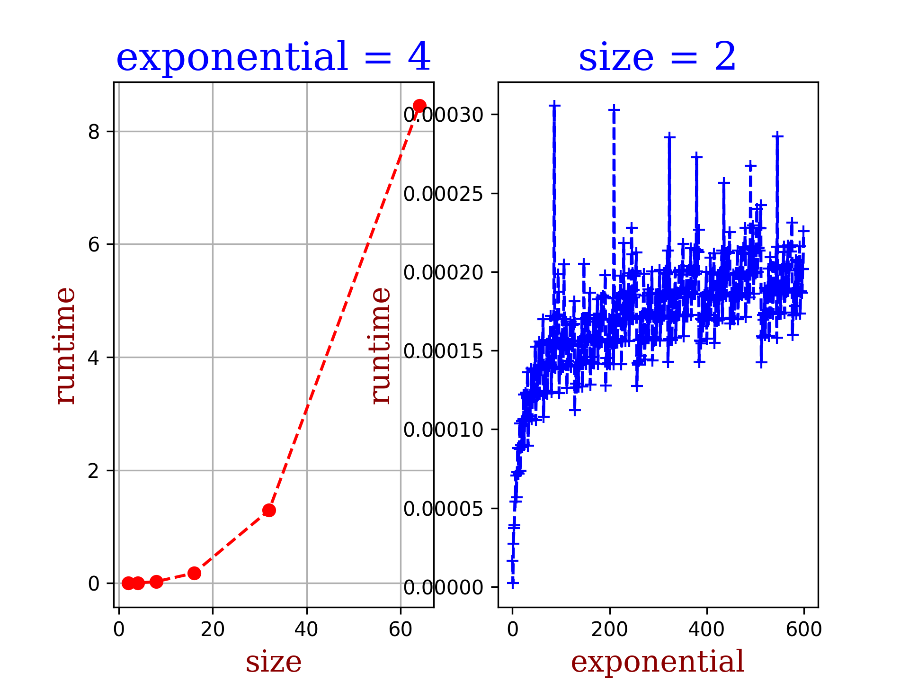
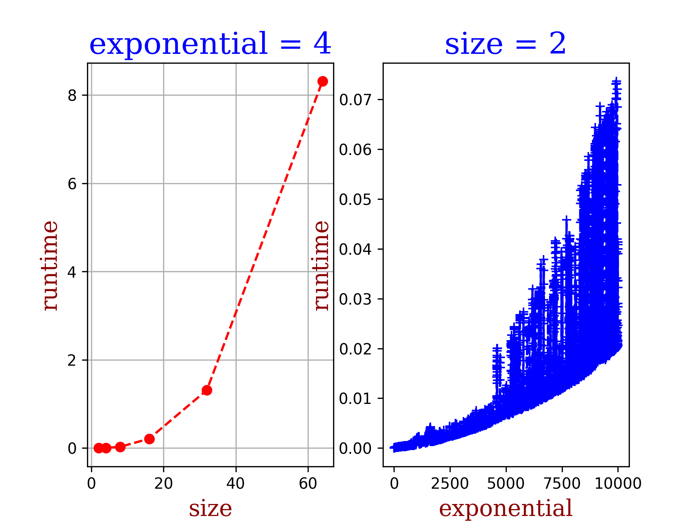

# Matrix Library

Author: Amittai Joel (github: @siavava)

***

```python
"""
...This file implements methods for matrix manipulation, including:

    1. matrix_power() ->
        divide-and-conquer strategies for
        finding a matrix exponential.
        This function makes use of Strassen's algorithm to optimize its runtime.

    2. matrix_multiply() ->
        an implementation of Strassen's O(n^log_2(7))
        algorithm for matrix faster matrix multiplication by substituting
        brute-force multiplication with strategic multiplications and additions.

    3. matrix_sum() ->
        Given two matrices, find their sum using brute-force methods.

    4. matrix_difference() ->
        Given two matrices A, B in order, find A - B using brute_force methods.

    5. matrix_get() ->
        A helper function that, given an n x n matrix such that n % 2 = 0
        and a position 0 <= x <= 3, returns the subset of the matrix.

    6. matrix_compile() ->
        A helper function that, given a larger matrix A and a smaller matrix B
        such that dim(A) = 2 * dim(B), saves the values in B into a
        specified subset of A.

    7. matrix_identity() ->
        A function that, given a dimension n, returns the (n x n) identity matrix.

    8. matrix_transpose() ->
        Given an (m x n) matrix, returns the (n x m) transpose of the matrix.
        
    IMPORTANT NOTE:
        It is usual to represent matrices as an array of arrays, wherein each sub-array
        represents either a column or row of the matrix. 
        
        In this implementation, each sub-array is interpreted to be a column of the matrix.
        It's important that the caller create/implement matrices with similar
        semantics, or the calculations are not guaranteed to be correct.

    (c) Amittai J. Wekesa (github: @siavava), May 2021.
...
"""
```
***
### Runtime 

On the left, we compute exponential 4 of different-sized matrices. 
As expected, the operation has close to quadratic runtime complexity -- the
time complexity of Strassen's matrix multiplication, which has a time
complexity of O(n^2.80). Since the matrix size grows, the added complexity of 
multiplying larger matrices dominates over the logarithmic complexity 
of finding the 4th power.

On the right, we use a simple [2x2] matrix and compute different powers.
The algorithm implemented for exponentials has a pure time complexity of
O(log n), so the plots for constant size show logarithmic complexity.

NOTE: as the exponentials grow, the numbers in the matrix become large and
the matrix multiplications start costing more, so the time complexity assumes
a more quadratic routine despite the dimension of the matrix staying the same.


