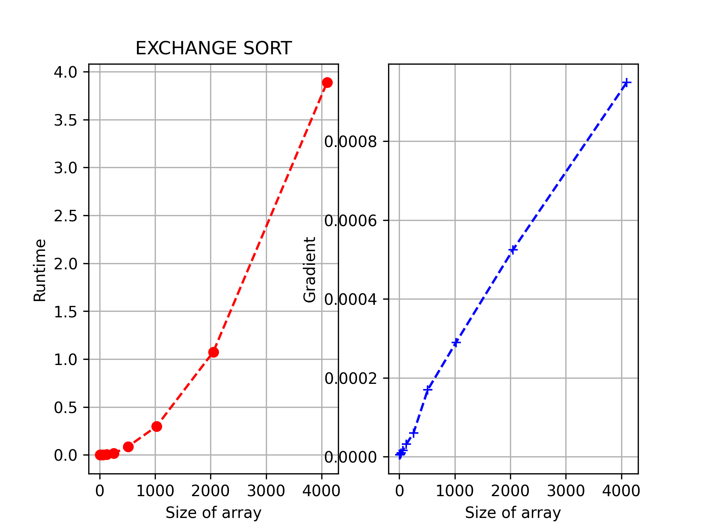
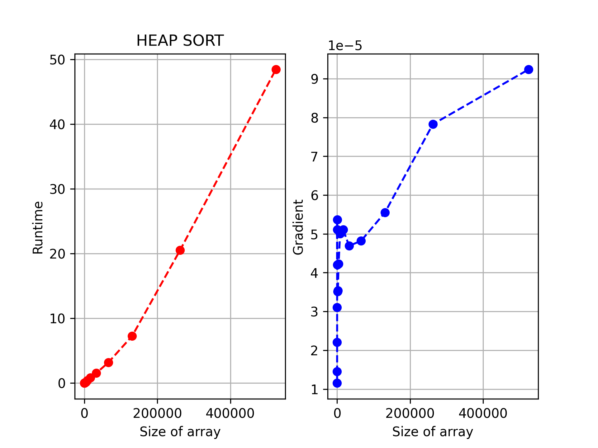
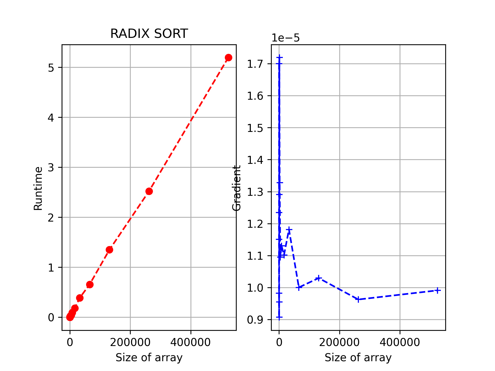
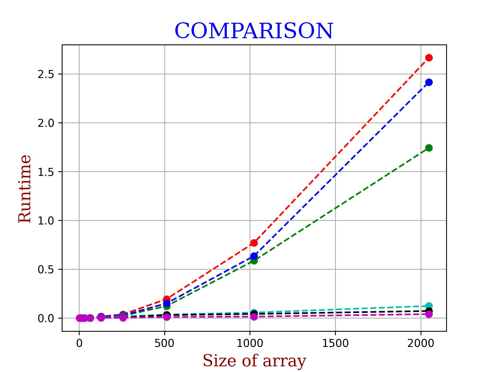

# Sorting Algorithms

Author: Amittai J. Wekesa (github: @siavava)

***
This directory implements various algorithms and analyzes their runtime:

* [Bubble Sort](./bubble_sort.py), a quadratic-time sorting algorithm which maintains a sorted prefix of an array
  and increases it by one, handling each conflict until the full array is sorted.
  
* [Exchange Sort](./exchange_sort.py), a quadratic-time sorting algorithm that loops through an array left to right, 
  exchanging values until a valid sorting is obtained.
  
* [Heap Sort](./heap_sort.py), an *n log n* sorting algorithm that arranges array elements in a heap 
  then repeatedly extracts the maximum value, appending it into a sorted array until the full array is sorted.
  
* [Insertion Sort](./insertion_sort.py), a quadratic-time sorting algorithm that loops through an array,
  maintains a sorted prefix, and repeatedly inserts each next element in its correct position
  until the array is sorted.
  
* [Merge Sort](./merge_sort.py), an *n log n* sorting algorithm that recursively splits arrays into two sub-arrays,
  sorts the sub-arrays, and merges them into one.
  
* [Radix Sort](./radix_sort.py), a *linear* time sorting algorithm that counts the occurrences of array elements 
  in different ranges then rearranges the array accordingly. Due to no direct comparisons, radix sort achieves
  better runtime than most of the other sorting algorithms.
 
  
 ***
To compare all sorting algorithms (on a reasonably sized problem), run `compare_all.py`.
Here is an example run:

All individual files also have a more elaborate test for correctness and runtime behavior.